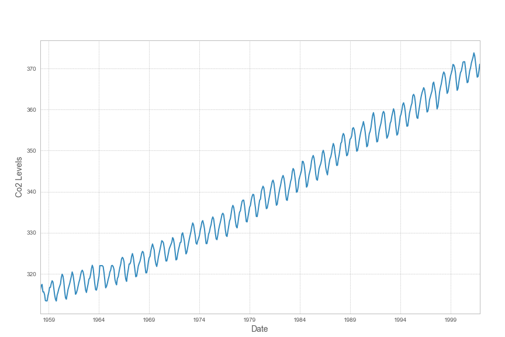
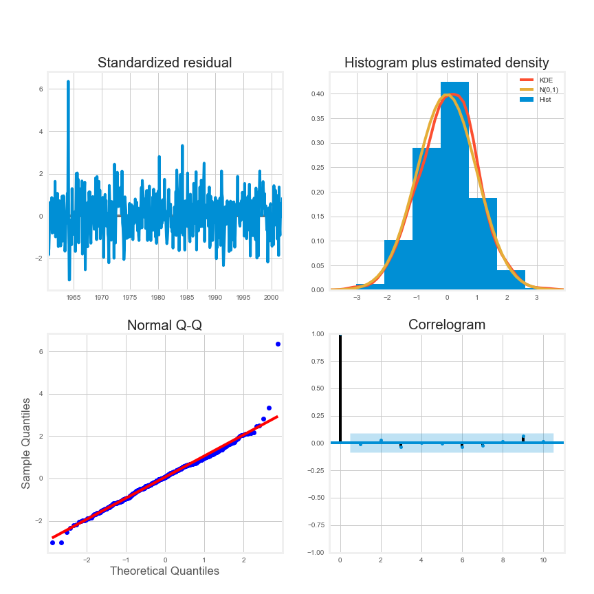

# Co2 Forecasting

This project is a gentle introduction to Time Series Modeling.

The Dataset used here is from the statsmodels library - "Atmospheric CO2 from Continuous Air Samples at Mauna Loa Observatory, Hawaii, U.S.A.," which collected CO2 samples from March 1958 to December 2001. 

We first start by loading in the dataset and transforming it such that we have readings for each month starting from March 1958 to December 2001.



A grid search is run next to identify the parameters for - the Auto Regressive (AR/p), integrated(I/d), Moving Average (MA/q), and Seasonal(P, D, Q) terms.

Setting Model evaluation metric to AIC score, the identified parameters that produces the best model with least AIC:
``` python
order=(1,1,1), seasonal_order=(1,1,1,12)
```

After fitting the seasonal ARIMA model, a model diagnostic test is run to verify if any assumptions made by the model have been violated



The purpose here is to ensure that residuals remain uncorrelated, normally distributed having zero mean. In the absence of these assumptions, we can not move forward and need further tweaking of the model.

- In the top right histogram and the qq-plot on the bottom left show that the residuals are normally distributed.

- The residuals over time (top left plot) don't display any obvious seasonality and appear to be white noise. This is confirmed by the autocorrelation (i.e. correlogram) plot on the bottom right, which shows that the time series residuals have low correlation with lagged versions of itself.

These observations lead us to conclude that our model has no correlations and provides a satisfactory fit to help forecast future values.


